# 使用 InfinityFree 免费主机搭建 TinyChat 手把手教程

不需要买服务器、不需要付费：用 [InfinityFree](https://dash.infinityfree.com/) 的免费虚拟主机，把 TinyChat 传上去就能跑起来，全程大概 10～15 分钟。

> 主机的控制面板会随官方改版而调整，截图里的按钮位置可能和现在略有出入，按同名入口操作即可。
> 对主机的硬性要求见主仓库的[环境要求](../../README.md#环境要求)：PHP ≥ 7.4，并启用 `pdo_sqlite`、`curl`、`openssl` 扩展。

## 1. 注册账号

打开 <https://dash.infinityfree.com/> 注册并登录。

## 2. 创建主机

在面板里创建一台主机。

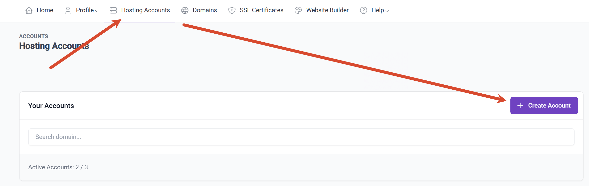

## 3. 选择免费主机

方案选择免费主机（Free Hosting）。

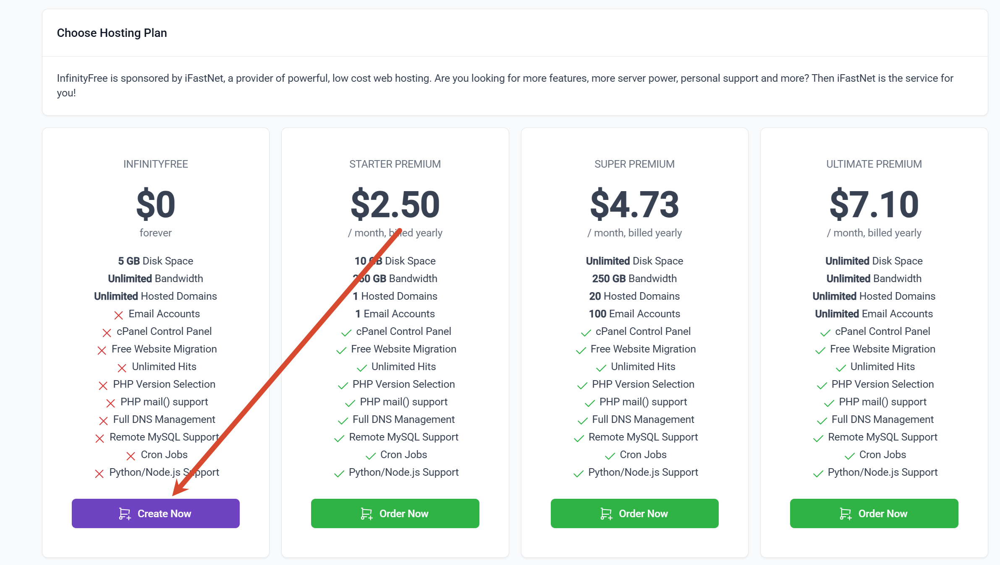

## 4. 输入前缀，选择二级域名

给自己的站点起一个前缀，并选一个二级域名。

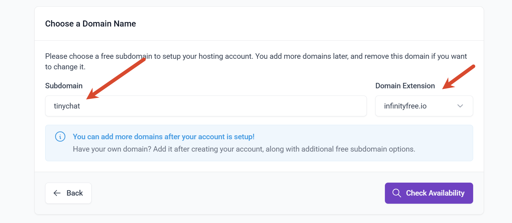

## 5. 选择同意，再选择创建

勾选同意条款后创建。

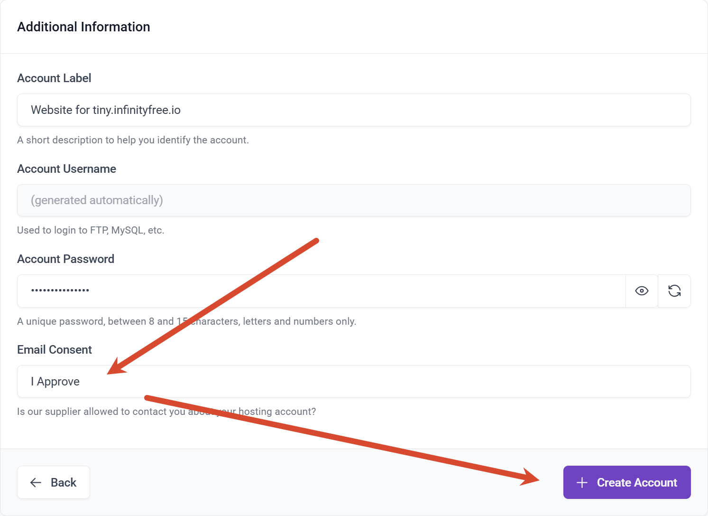

## 6. 返回主页，选择 Manage，再选 Control Panel

主机创建好以后，回到列表进入该主机的 Control Panel。

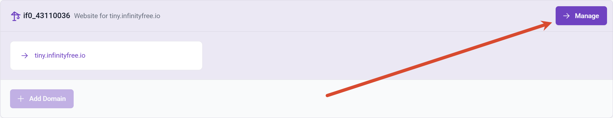

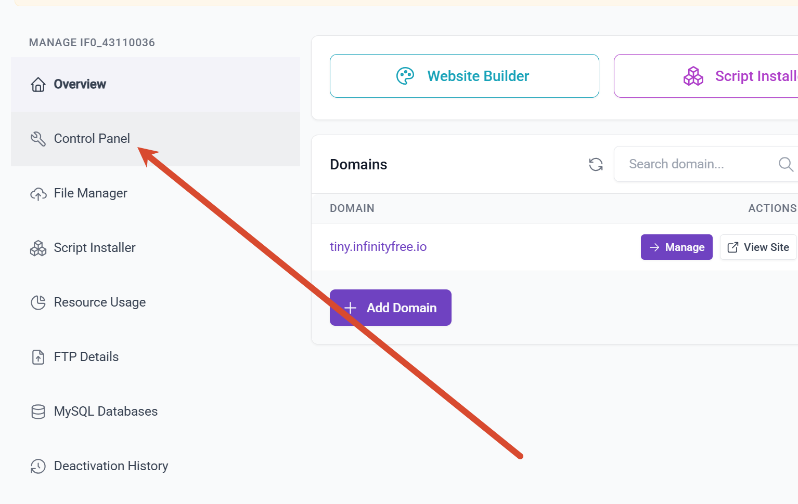

## 7. 选择在线文件管理

在 Control Panel 里打开在线文件管理器（Online File Manager）。

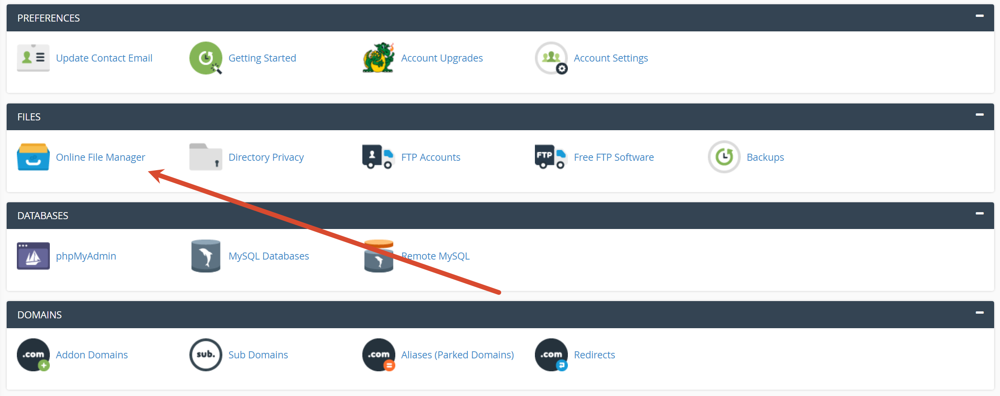

## 8. 前往网页下载最新发行版

到 <https://github.com/TinyNano/TinyChat/releases> 下载**最新发行版**，选择 zip 包。

## 9. 进入 htdocs 文件夹，删除原有文件

网站的运行目录是 `htdocs`。先进入 `htdocs`，把里面原有的占位文件删掉。

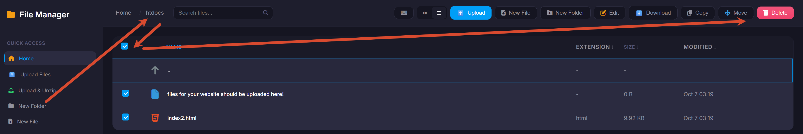

## 10. 选择 Upload & Unzip 上传下载的 zip 文件

用文件管理器里的 `Upload & Unzip` 直接上传刚才下载的 zip，它会自动解压。

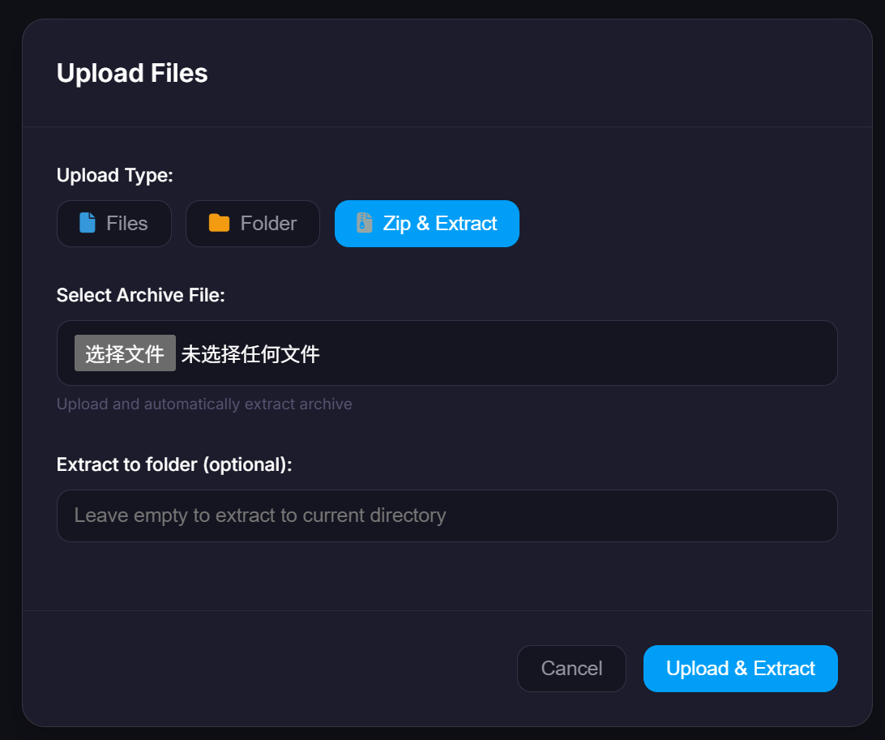

## 11. 把文件移到运行目录

解压出来的内容会在 `Home/htdocs/TinyChat-XXXX` 这样一个**子目录**里，而这不是运行目录。需要把它里面的内容移到 `htdocs` 根目录：

1. 进入该子目录，**全选**所有文件；
2. 点 `Move`；
3. 点一次 `Parent Directory`，滚动到列表最后；
4. 点确认。移动文件需要等一会儿，成功前请勿重复点击。

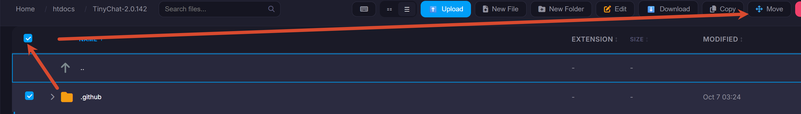

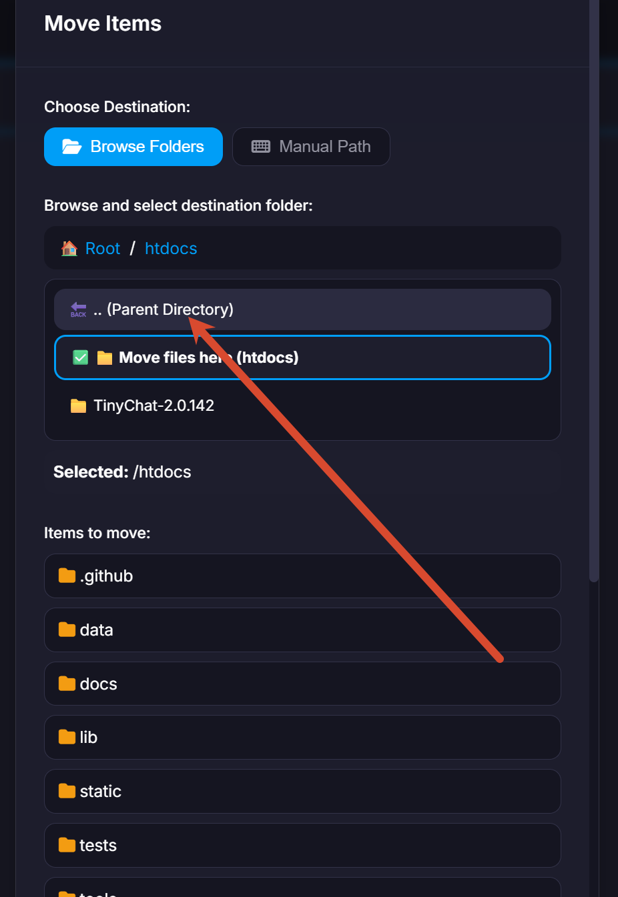

移动完成后，`htdocs` 根目录下应该**直接**能看到 `index.php`、`.htaccess`、`lib/`、`static/`、`vendor/` 等内容，而不是再套一层文件夹。

## 12. 访问你刚刚注册的子域 /login

浏览器打开 `https://你的子域/login`（把 `你的子域` 换成第 4 步注册的二级域名），登录页会自动进入安装流程；按提示创建管理员，之后就能在首页左下角进入后台。

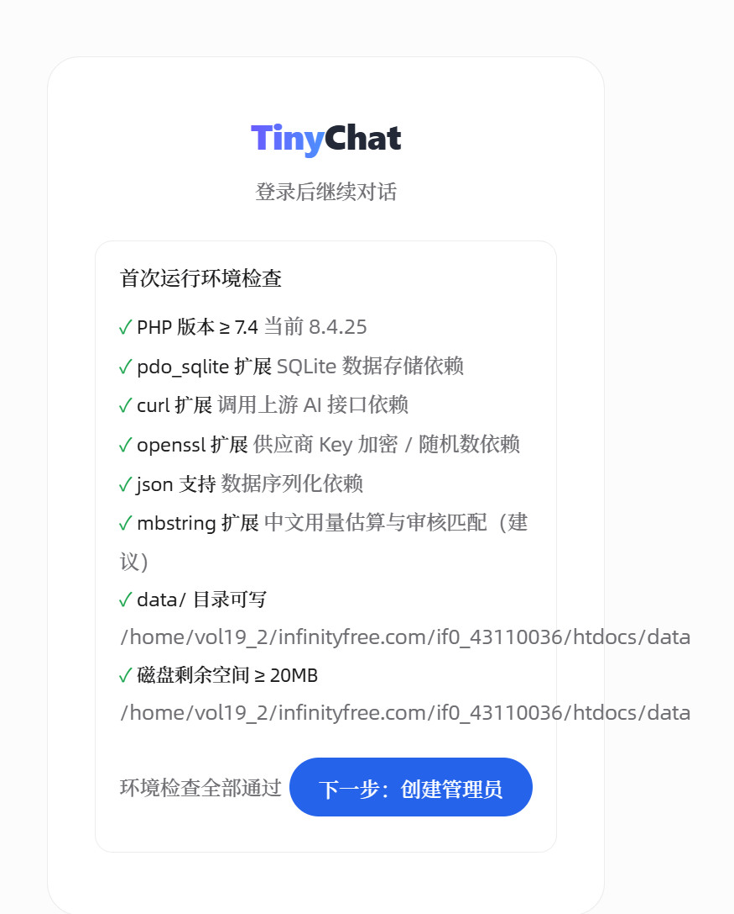

## 13. 接入模型并开始使用

在后台接入一个 OpenAI 兼容的接口即可开始对话，其他设置按你的需要配置。建议顺手配置：

- **联网搜索**：接入 Tavily 的 Key；
- **模型元数据**：可在后台点「从 litellm 同步」，用于显示上下文窗口与价格估算。

## 排错

- **上传的必须是仓库全部文件**：`index.php`、`.htaccess`、`lib/`、`static/`、`vendor/` 都要在运行目录里，不要只传 `public`。
- **打开是 404、空白页或目录列表**：多半是第 11 步没做对，文件还套在 `TinyChat-XXXX/` 里；确认 `htdocs` 根目录下能直接看到 `index.php`。
- **环境自检提示 `data/` 目录不可写**：按主仓库 README 的[目录权限](../../README.md#目录权限重要)一节处理。
- **页面报 500 或提示缺扩展**：确认主机 PHP 版本 ≥ 7.4，且 `pdo_sqlite` / `curl` / `openssl` 都已启用。
- **换成自己的域名**：在 InfinityFree 面板里把域名解析到这台主机，并在 `config.php` 里显式设置 `SITE_URL`（见主仓库的[配置](../../README.md#配置configphp--环境变量)一节）。
